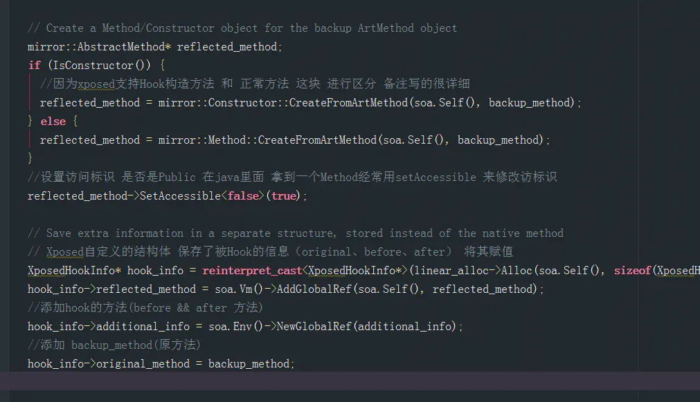
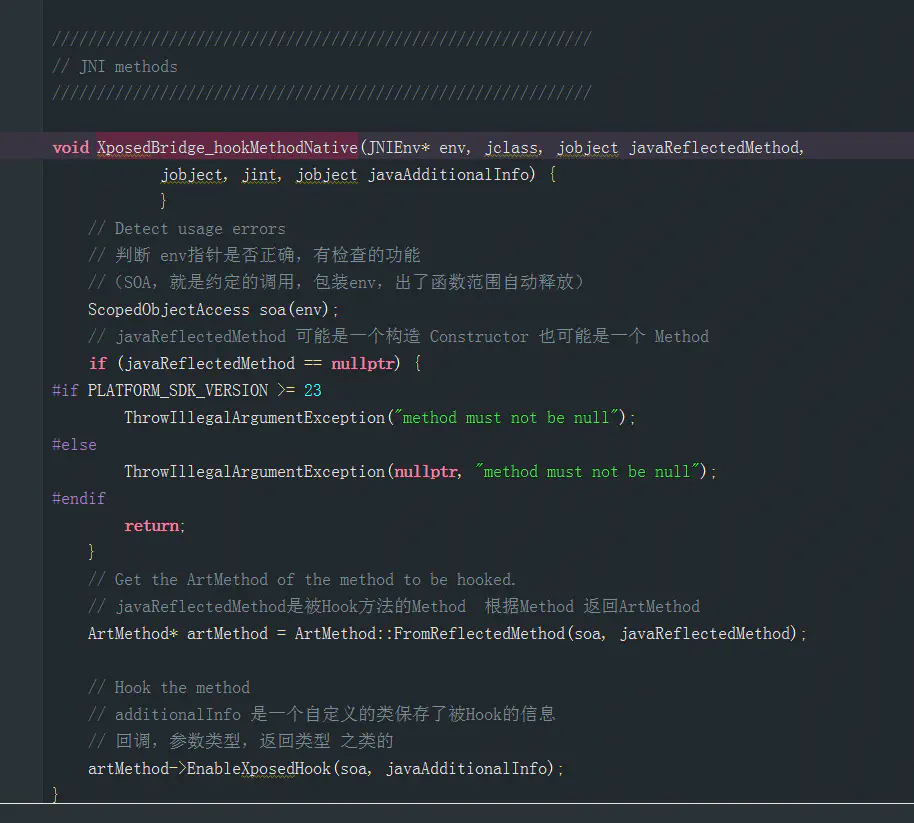

# xposed源码分析
在xposed中主要包含了以下组件
1. XposedBridge: Xposed 提供的 jar 文件，app_process 启动过程中会加载该 jar 包，其 他的 Modules 的开发都是基于该 jar 包;
2. Xposed: Xposed 的 C++ 部 分 ， 主 要 是 用 来 替 换 /system/bin/app_process ， 并 为 XposedBridge 提供 JNI 方法;
3. XposedInstaller: Xposed 的安装包，提供对基于 Xposed 框架的 Modules 的管理;
4. android_art: Xposed修改的art部分源码

我们都知道xposed主要是修改了app_process的启动流程,具体是怎么修改的？ 在此之前先学校一下art虚拟机的启动流程

## 前提知识
1.art虚拟机的启动流程

Android的启动过程也是从/system/core/init/init.c的main函数开始(这里忽略了bootloader的引导以及Linux Kernel的启动)。init.c这个文件做的事情比较多，这里我们只关注和Java层有关的东西。init.c中解析init.rc文件，在init.rc中和Java世界相关的是zygote，它在一个脚本文件中被系统创建出来，如下

```c
    service zygote /system/bin/app_process -Xzygote /system/bin --zygote --start-system-server
    class main
    socket zygote stream 660 root system
    onrestart write /sys/android_power/request_state wake
    onrestart write /sys/power/state on
    onrestart restart media
    onrestart restart netd
```

解析参数 app_process是二进制文件 在它的main函数里解析参数 /system/bin/app_process -Xzygote /system/bin --zygote --start-system-server ,进入runtime.start

```c
int main(int argc, char* const argv[])
{
    ....
    AppRuntime runtime(argv[0], computeArgBlockSize(argc, argv));
    argc--;
    argv++;
    int i;
    for (i = 0; i < argc; i++) {
        if (argv[i][0] != '-') {
            break;
        }
        if (argv[i][1] == '-' && argv[i][2] == 0) {
            ++i; // Skip --.
            break;
        }
        runtime.addOption(strdup(argv[i]));
    }
    ....
    // Parse runtime arguments.  Stop at first unrecognized option.
    ++i;  // Skip unused "parent dir" argument.
    while (i < argc) {
        const char* arg = argv[i++];
        if (strcmp(arg, "--zygote") == 0) {
            zygote = true;
            niceName = ZYGOTE_NICE_NAME;
        } else if (strcmp(arg, "--start-system-server") == 0) {
            startSystemServer = true;
        } else if (strcmp(arg, "--application") == 0) {
            application = true;
        } else if (strncmp(arg, "--nice-name=", 12) == 0) {
            niceName.setTo(arg + 12);
        } else if (strncmp(arg, "--", 2) != 0) {
            className.setTo(arg);
            break;
        } else {
            --i;
            break;
        }
    }
    ....
    if (!className.isEmpty()) {
        ....
    } else {
        // We're in zygote mode.
        maybeCreateDalvikCache();
        ...
    }
    if (!niceName.isEmpty()) {
        runtime.setArgv0(niceName.string());
        set_process_name(niceName.string());
    }
    args = "[“start-system-server”, “–abi-list=x86”]"
    if (zygote) {
        runtime.start("com.android.internal.os.ZygoteInit", args);
    } else if (className) {
        runtime.start("com.android.internal.os.RuntimeInit", args);
    } else {
        fprintf(stderr, "Error: no class name or --zygote supplied.\n");
        app_usage();
        LOG_ALWAYS_FATAL("app_process: no class name or --zygote supplied.");
        return 10;
    }
}
```

进入start

```c
void AndroidRuntime::start(const char* className, const Vector<String8>& options)
{
    ....
    /* start the virtual machine */
    JniInvocation jni_invocation;
    jni_invocation.Init(NULL);//加载art虚拟机的核心库，获得几个人函数的函数指针
    /*
    1. JNI_GetDefaultJavaVMInitArgs -- 获取虚拟机的默认初始化参数
2. JNI_CreateJavaVM -- 在进程中创建虚拟机实例
3. JNI_GetCreatedJavaVMs -- 获取进程中创建的虚拟机实例
*/
    JNIEnv* env;
    if (startVm(&mJavaVM, &env) != 0) {
        return;
    }
    onVmCreated(env);

    /*
     * Register android functions.
     */
    if (startReg(env) < 0) {
        ALOGE("Unable to register all android natives\n");
        return;
    }

    /*
     * We want to call main() with a String array with arguments in it.
     * At present we have two arguments, the class name and an option string.
     * Create an array to hold them.
     */
    jclass stringClass;
    jobjectArray strArray;
    jstring classNameStr;

    stringClass = env->FindClass("java/lang/String");
    assert(stringClass != NULL);
    strArray = env->NewObjectArray(options.size() + 1, stringClass, NULL);
    assert(strArray != NULL);
    classNameStr = env->NewStringUTF(className);
    assert(classNameStr != NULL);
    env->SetObjectArrayElement(strArray, 0, classNameStr);

    for (size_t i = 0; i < options.size(); ++i) {
        jstring optionsStr = env->NewStringUTF(options.itemAt(i).string());
        assert(optionsStr != NULL);
        env->SetObjectArrayElement(strArray, i + 1, optionsStr);
    }

    /*
     * Start VM.  This thread becomes the main thread of the VM, and will
     * not return until the VM exits.
     */
    
    /*
找到一个名称为com.android.internal.os.ZygoteInit的类，以及它的静态成员函数main，然后就以这个函数为入口，开始运行ART虚拟机。为此，函数执行了以下步骤：

① 调用JNI接口FindClass加载com.android.internal.os.ZygoteInit类。

② 调用JNI接口GetStaticMethodID找到com.android.internal.os.ZygoteInit类的静态成员函数main。

③ 调用JNI接口CallStaticVoidMethod开始执行com.android.internal.os.ZygoteInit类的静态成员函数main。    
    
    */
    char* slashClassName = toSlashClassName(className);
    jclass startClass = env->FindClass(slashClassName);
    if (startClass == NULL) {
        ALOGE("JavaVM unable to locate class '%s'\n", slashClassName);
        /* keep going */
    } else {
        jmethodID startMeth = env->GetStaticMethodID(startClass, "main",
            "([Ljava/lang/String;)V");
        if (startMeth == NULL) {
            ALOGE("JavaVM unable to find main() in '%s'\n", className);
            /* keep going */
        } else {
            env->CallStaticVoidMethod(startClass, startMeth, strArray);

#if 0
            if (env->ExceptionCheck())
                threadExitUncaughtException(env);
#endif
        }
    }
    free(slashClassName);

    ALOGD("Shutting down VM\n");
    if (mJavaVM->DetachCurrentThread() != JNI_OK)
        ALOGW("Warning: unable to detach main thread\n");
    if (mJavaVM->DestroyJavaVM() != 0)
        ALOGW("Warning: VM did not shut down cleanly\n");
}

```

->创建JniInvocation，加载art虚拟机so文件(libart.so)。
->调用函数startVM，创建JavaVM和JNIEnv
->注册Android jni方法
->启动到Java世界

## xposed 组件干的事
### xposed-installer 
（替换文件）获得手机信息下载安装包，解压替换so app_process ，然后重启(所以需要root)
system
      lib64
        libart.so
        libart-compiler.so
        libart-disassembler.so
        libsigchain.so
        libxposed_art.so
      lib
        libart.so
        libart-compiler.so
        libsigchain.so
        libxposed_art.so
     framework
        XposedBridge.jar（注入到对应app进程里面的jar包）
      bin
        app_process32_xposed
        app_process64_xposed
        dex2oat
        patchoat
      xposed.prop
          xposed版本说明文件

### xposed 
修改art虚拟机初始化过程，启动xposed的虚拟机 ,同时作为hook函数jni的底层实现

xposed-installer 替换了app_process,所以系统从xposed的app_process执行，对比原版的app_process修改了两处

其一，红框的地方 是判断是否是Xposed版本的虚拟机

第二处 runtime.start加载的不同了，当isxposedloaded true 就加载了XPOSED_CLASS_DOTS_ZYGOTE

```c
#define XPOSED_CLASS_DOTS_ZYGOTE "de.robv.android.xposed.XposedBridge"
```


```c
 if (zygote) {
        isXposedLoaded = xposed::initialize(true, startSystemServer, NULL, argc, argv);
        runtimeStart(runtime, isXposedLoaded ? XPOSED_CLASS_DOTS_ZYGOTE : "com.android.internal.os.ZygoteInit", args, zygote);
    } else if (className) {
        isXposedLoaded = xposed::initialize(false, false, className, argc, argv);
        runtimeStart(runtime, isXposedLoaded ? XPOSED_CLASS_DOTS_TOOLS : "com.android.internal.os.RuntimeInit", args, zygote);
    } else {
        fprintf(stderr, "Error: no class name or --zygote supplied.\n");
        app_usage();
        LOG_ALWAYS_FATAL("app_process: no class name or --zygote supplied.");
        return 10;
    }
```

先来看看xposed::initialize

```c
bool initialize(bool zygote, bool startSystemServer, const char* className, int argc, char* const argv[]) {
#if !defined(XPOSED_ENABLE_FOR_TOOLS)
    if (!zygote)
        return false;
#endif

    if (isMinimalFramework()) {
        ALOGI("Not loading Xposed for minimal framework (encrypted device)");
        return false;
    }

    xposed->zygote = zygote;
    xposed->startSystemServer = startSystemServer;
    xposed->startClassName = className;
    xposed->xposedVersionInt = xposedVersionInt;

#if XPOSED_WITH_SELINUX
    xposed->isSELinuxEnabled   = is_selinux_enabled() == 1;
    xposed->isSELinuxEnforcing = xposed->isSELinuxEnabled && security_getenforce() == 1;
#else
    xposed->isSELinuxEnabled   = false;
    xposed->isSELinuxEnforcing = false;
#endif  // XPOSED_WITH_SELINUX

    if (startSystemServer) {
        xposed::logcat::printStartupMarker();
    } else if (zygote) {
        // TODO Find a better solution for this
        // Give the primary Zygote process a little time to start first.
        // This also makes the log easier to read, as logs for the two Zygotes are not mixed up.
        sleep(10);
    }

    printRomInfo();

    if (startSystemServer) {
        if (!determineXposedInstallerUidGid() || !xposed::service::startAll()) {
            return false;
        }
        xposed::logcat::start();
#if XPOSED_WITH_SELINUX
    } else if (xposed->isSELinuxEnabled) {
        if (!xposed::service::startMembased()) {
            return false;
        }
#endif  // XPOSED_WITH_SELINUX
    }

#if XPOSED_WITH_SELINUX
    // Don't let any further forks access the Zygote service
    if (xposed->isSELinuxEnabled) {
        xposed::service::membased::restrictMemoryInheritance();
    }
#endif  // XPOSED_WITH_SELINUX

    // FIXME Zygote has no access to input devices, this would need to be check in system_server context
    if (zygote && !isSafemodeDisabled() && detectSafemodeTrigger(shouldSkipSafemodeDelay()))
        disableXposed();

    if (isDisabled() || (!zygote && shouldIgnoreCommand(argc, argv)))
        return false;

    return addJarToClasspath();
}

```

它主要做了两件事 填充xposed这个结构体 以及addJarToClasspath(); addJarToClasspath主要是将XposedBridge加入环境变量(这里可以侦察xposed)，如果成功就是进入runtime 启动de.robv.android.xposed.XposedBridged的main函数（前面art虚拟机的流程）

而`XposedBridge`文件的`main`函数如下，其实就是一个对`SELinux`的处理以及对`Xposed`模块的加载。

```c
protected static void main(String[] args) {
        // Initialize the Xposed framework and modules
        try {
            if (!hadInitErrors()) {
                initXResources();
 
                SELinuxHelper.initOnce();
                SELinuxHelper.initForProcess(null);
 
                runtime = getRuntime();
                XPOSED_BRIDGE_VERSION = getXposedVersion();
 
                if (isZygote) {
          // 暂且忽略
                    XposedInit.hookResources();
                    XposedInit.initForZygote();
                }
            // 模块的加载
                XposedInit.loadModules();
            } else {
                Log.e(TAG, "Not initializing Xposed because of previous errors");
            }
        } catch (Throwable t) {
            Log.e(TAG, "Errors during Xposed initialization", t);
            disableHooks = true;
        }
 
        // Call the original startup code
        if (isZygote) {
            ZygoteInit.main(args);
        } else {
            RuntimeInit.main(args);
        }
    }
```


### xposedbridge 

用来hook 注入的，作为hook的表层函数

### art

替换libart.so文件，对其进行一些修改

## hook过程的分析

当我们写入findandhookmethod时

```c
	public static XC_MethodHook.Unhook findAndHookMethod(Class<?> clazz, String methodName, Object... parameterTypesAndCallback) {
		//查看最后一项是不是xc_method
		if (parameterTypesAndCallback.length == 0 || !(parameterTypesAndCallback[parameterTypesAndCallback.length-1] instanceof XC_MethodHook))
			throw new IllegalArgumentException("no callback defined");

		XC_MethodHook callback = (XC_MethodHook) parameterTypesAndCallback[parameterTypesAndCallback.length-1];
		//反射得到method这个类
		Method m = findMethodExact(clazz, methodName, getParameterClasses(clazz.getClassLoader(), parameterTypesAndCallback));

		return XposedBridge.hookMethod(m, callback);
	}
```

接着进入hookmethod


它得到要hook方法的类，方法在类中的偏移 hook方法的参数，hook方法的返回类型，hook的函数，调用hookmethodnative(在xposed里)



fromreflectmethod就是调用里面的GetArtMethod，在art虚拟机中，每一个加载的类方法都有一个对应的ArtMethod对象。

返回去 继续看 EnableXposedHook 函数(art里面了)

```c
void ArtMethod::EnableXposedHook(ScopedObjectAccess& soa, jobject additional_info) {
  if (UNLIKELY(IsXposedHookedMethod())) {
    // Already hooked
    return;
  } else if (UNLIKELY(IsXposedOriginalMethod())) {
    // This should never happen
    ThrowIllegalArgumentException(StringPrintf("Cannot hook the method backup: %s", PrettyMethod(this).c_str()).c_str());
    return;
  }

  // Create a backup of the ArtMethod object
  //给原函数做个备份
  auto* cl = Runtime::Current()->GetClassLinker();
  auto* linear_alloc = cl->GetAllocatorForClassLoader(GetClassLoader());
  ArtMethod* backup_method = cl->CreateRuntimeMethod(linear_alloc);
  backup_method->CopyFrom(this, cl->GetImagePointerSize());
  backup_method->SetAccessFlags(backup_method->GetAccessFlags() | kAccXposedOriginalMethod);

  // Create a Method/Constructor object for the backup ArtMethod object
  //看看是方法还是狗营造函数
  mirror::AbstractMethod* reflected_method;
  if (IsConstructor()) {
    reflected_method = mirror::Constructor::CreateFromArtMethod(soa.Self(), backup_method);
  } else {
    reflected_method = mirror::Method::CreateFromArtMethod(soa.Self(), backup_method);
  }
  reflected_method->SetAccessible<false>(true);

  // Save extra information in a separate structure, stored instead of the native method
  
  XposedHookInfo* hook_info = reinterpret_cast<XposedHookInfo*>(linear_alloc->Alloc(soa.Self(), sizeof(XposedHookInfo)));
  hook_info->reflected_method = soa.Vm()->AddGlobalRef(soa.Self(), reflected_method);
  hook_info->additional_info = soa.Env()->NewGlobalRef(additional_info);
  hook_info->original_method = backup_method;

  ScopedThreadSuspension sts(soa.Self(), kSuspended);//悬挂进程
  jit::ScopedJitSuspend sjs;//取消jit即时编译
  gc::ScopedGCCriticalSection gcs(soa.Self(),
                                  gc::kGcCauseXposed,
                                  gc::kCollectorTypeXposed);//防止死锁
  ScopedSuspendAll ssa(__FUNCTION__);//暂停调用方法的所有线程

  cl->InvalidateCallersForMethod(soa.Self(), this);//取消所有调用

  jit::Jit* jit = art::Runtime::Current()->GetJit();//去除jit的编译结果
  if (jit != nullptr) {
    jit->GetCodeCache()->MoveObsoleteMethod(this, backup_method);
  }
////将entry_point_from_jni_指针指向hook信息（目的是存储），hook信息包括原函数、before函数、after函数 (native方法的)
  SetEntryPointFromJniPtrSize(reinterpret_cast<uint8_t*>(hook_info), sizeof(void*));
  SetEntryPointFromQuickCompiledCode(GetQuickProxyInvokeHandler());//重新设置EntryPointFromQuickCompiledCode为QuickProxyInvokeHandler（获得本地机器码执行的首地址）
  SetCodeItemOffset(0);

  // Adjust access flags.
  const uint32_t kRemoveFlags = kAccNative | kAccSynchronized | kAccAbstract | kAccDefault | kAccDefaultConflict;
  SetAccessFlags((GetAccessFlags() & ~kRemoveFlags) | kAccXposedHookedMethod);

  MutexLock mu(soa.Self(), *Locks::thread_list_lock_);
  Runtime::Current()->GetThreadList()->ForEach(StackReplaceMethodAndInstallInstrumentation, this);
}

}  // namespace art

```


把Method对象，方法额外信息和原始方法保存至XposedHookInfo结构体中，并调用SetEntryPointFromJni()把这个结构体变量的内存地址保存在ArtMethod对象中。这个方法原本是用来保存native方法的入口地址的，既然使用了这个位置，那么就必须把对应的标志位清除，代码实现的最后调用SetAccessFlags((GetAccessFlags() & ~kAccNative & ~kAccSynchronized) | kAccXposedHookedMethod)来完成标志位的清除（设置Fast_jni模式），此时这个ArtMethod对象对应是Hook后的方法，这个方法的实现不是native的。(也是查看xposed的一种手段)

这么一来完成了整体Hook流程

### invoke触发

触发从artmethod::invoke开始，主要是触发了

```c
   }

      if (!IsStatic()) {
        (*art_quick_invoke_stub)(this, args, args_size, self, result, shorty);
      } else {
        (*art_quick_invoke_static_stub)(this, args, args_size, self, result, shorty);
      }
```

art_quick_invoke_stub主要是出发了ART_METHOD_QUICK_CODE_OFFSET_32

```c
ENTRY art_quick_invoke_stub_internal
    SPILL_ALL_CALLEE_SAVE_GPRS             @ spill regs (9)
    mov    r11, sp                         @ save the stack pointer
    .cfi_def_cfa_register r11

    mov    r9, r3                          @ move managed thread pointer into r9

    add    r4, r2, #4                      @ create space for method pointer in frame
    sub    r4, sp, r4                      @ reserve & align *stack* to 16 bytes: native calling
    and    r4, #0xFFFFFFF0                 @ convention only aligns to 8B, so we have to ensure ART
    mov    sp, r4                          @ 16B alignment ourselves.

    mov    r4, r0                          @ save method*
    add    r0, sp, #4                      @ pass stack pointer + method ptr as dest for memcpy
    bl     memcpy                          @ memcpy (dest, src, bytes)
    mov    ip, #0                          @ set ip to 0
    str    ip, [sp]                        @ store null for method* at bottom of frame

    ldr    ip, [r11, #48]                  @ load fp register argument array pointer
    vldm   ip, {s0-s15}                    @ copy s0 - s15

    ldr    ip, [r11, #44]                  @ load core register argument array pointer
    mov    r0, r4                          @ restore method*
    add    ip, ip, #4                      @ skip r0
    ldm    ip, {r1-r3}                     @ copy r1 - r3

#ifdef ARM_R4_SUSPEND_FLAG
    mov    r4, #SUSPEND_CHECK_INTERVAL     @ reset r4 to suspend check interval
#endif

    ldr    ip, [r0, #ART_METHOD_QUICK_CODE_OFFSET_32]  @ get pointer to the code
    blx    ip                              @ call the method

    mov    sp, r11                         @ restore the stack pointer
    .cfi_def_cfa_register sp

    ldr    r4, [sp, #40]                   @ load result_is_float
    ldr    r9, [sp, #36]                   @ load the result pointer
    cmp    r4, #0
    ite    eq
    strdeq r0, [r9]                        @ store r0/r1 into result pointer
    vstrne d0, [r9]                        @ store s0-s1/d0 into result pointer

    pop    {r4, r5, r6, r7, r8, r9, r10, r11, pc}               @ restore spill regs
END art_quick_invoke_stub_internal

```

ART_METHOD_QUICK_CODE_OFFSET_32获得entry_point_from_quick_compiled_code xposed hook成了art_quick_proxy_invoke_handler调用了artQuickProxyInvokeHandler

```c
extern "C" uint64_t artQuickProxyInvokeHandler(
    ArtMethod* proxy_method, mirror::Object* receiver, Thread* self, ArtMethod** sp)
    SHARED_REQUIRES(Locks::mutator_lock_) {
  const bool is_xposed = proxy_method->IsXposedHookedMethod();
  ...
  if (is_xposed) {
    jmethodID proxy_methodid = soa.EncodeMethod(proxy_method);
    self->EndAssertNoThreadSuspension(old_cause);
    JValue result = InvokeXposedHandleHookedMethod(soa, shorty, rcvr_jobj, proxy_methodid, args);
    local_ref_visitor.FixupReferences();
    return result.GetJ();
  }
}
```

InvokeXposedHandleHookedMethod

```c
  const XposedHookInfo* hook_info = soa.DecodeMethod(method)->GetXposedHookInfo();
 
  // Call XposedBridge.handleHookedMethod(Member method, int originalMethodId, Object additionalInfoObj,
  //                                      Object thisObject, Object[] args)
// 利用jvalue传递参数
  jvalue invocation_args[5];
  invocation_args[0].l = hook_info->reflected_method;
  invocation_args[1].i = 1;
  invocation_args[2].l = hook_info->additional_info;
  invocation_args[3].l = rcvr_jobj;
  invocation_args[4].l = args_jobj;
  /*
   #define CLASS_XPOSED_BRIDGE  "de/robv/android/xposed/XposedBridge"
    classXposedBridge = env->FindClass(CLASS_XPOSED_BRIDGE);
    ArtMethod::xposed_callback_class = classXposedBridge;
     methodXposedBridgeHandleHookedMethod = env->GetStaticMethodID(classXposedBridge, "handleHookedMethod",
       "(Ljava/lang/reflect/Member;ILjava/lang/Object;Ljava/lang/Object;[Ljava/lang/Object;)Ljava/lang/Object;");
    ArtMethod::xposed_callback_method = methodXposedBridgeHandleHookedMethod;
  */
  jobject result =
      soa.Env()->CallStaticObjectMethodA(ArtMethod::xposed_callback_class,
                                         ArtMethod::xposed_callback_method,
                                         invocation_args);
```

又到java层了

此时再次回到`XposedBridge`的源码,找到对应`handleHookedMethod`函数的实现会发现

1. 先调用了`CallBack`中的`beforeHookedMethod`函数。

   ```java
   // call "before method" callbacks
           int beforeIdx = 0;
           do {
               try {
                   ((XC_MethodHook) callbacksSnapshot[beforeIdx]).beforeHookedMethod(param);
               } catch (Throwable t) {
                   XposedBridge.log(t);
    
                   // reset result (ignoring what the unexpectedly exiting callback did)
                   param.setResult(null);
                   param.returnEarly = false;
                   continue;
               }
    
               if (param.returnEarly) {
                   // skip remaining "before" callbacks and corresponding "after" callbacks
                   beforeIdx++;
                   break;
               }
           } while (++beforeIdx < callbacksLength);
   ```

   2.然后通过`invokeOriginalMethodNative`调用原函数

   ```java
   // call original method if not requested otherwise
           if (!param.returnEarly) {
               try {
                   param.setResult(invokeOriginalMethodNative(method, originalMethodId,
                           additionalInfo.parameterTypes, additionalInfo.returnType, param.thisObject, param.args));
               } catch (InvocationTargetException e) {
                   param.setThrowable(e.getCause());
               }
           }
   ```

   3.最后执行所有的`afterHookedMethod`回调。

   ```java
   // call "after method" callbacks
           int afterIdx = beforeIdx - 1;
           do {
               Object lastResult =  param.getResult();
               Throwable lastThrowable = param.getThrowable();
    
               try {
                   ((XC_MethodHook) callbacksSnapshot[afterIdx]).afterHookedMethod(param);
               } catch (Throwable t) {
                   XposedBridge.log(t);
    
                   // reset to last result (ignoring what the unexpectedly exiting callback did)
                   if (lastThrowable == null)
                       param.setResult(lastResult);
                   else
                       param.setThrowable(lastThrowable);
               }
           } while (--afterIdx >= 0);
   ```

   总结：

   执行流程：
   XposedBridge.hookMethod-》XposedBridge.hookMethodNative-》EnableXposedHook

   核心代码So层里面的 hookMethodNative 和 XposedBridge_hookMethodNative 里面

   1,hookMethodNative 先将java层传入的 被Hook的信息转换成 ArtMethod，方便调用方法进行Hook，调用EnableXposedHook 方法。

   2,在 EnableXposedHook 进行简单的判断 是否是被Hook的方法，以及是否已经被Hook过
   准备一个备份的 ArtMethod 存放 原方法的信息，将备份的ArtMethod 设置信息，所属类，告诉虚拟机这个方法不需要JIT编译，并将其设置成Native，准备一个简单的结构体XposedHookInfo保存，保存被Hook方法的信息，包括原方法的信息，地址，最后将 入口设置成 XposedHookInfo，设置机械码执行的首地址，将原方法的 CodeItem偏移设置0。

   之后查看hook 函数的触发 在artmethod::invoke

   

   ## 检验xposed的方法：

   1.（findandhookmethod将方法改为native了）查看方法变为native了 getDeclaredMethod

   2.getClassName 检测是否存在 de.robv.android.xposed. com.android.internal.os.ZygoteInit com.saurik.substrate. getMethodName检测 handleHookedMethod main invoked

   3.检查xposed的文件

   4.检查 安装包

   5.（xposedinstaller替换）检查　/system/lib　是否有xposed文件 　　　　/system/lib/libxposed_art.so 　　　　/system/lib64/libxposed_art.so

   6.(xposedinstall的)检查　/system/framework/XposedBridge.jar

   7.通过 代码抛出一个异常，在堆栈中检查是否含有　 de.robv.android.xposed.XposedBridge　之类的

   检查com.android.internal.os.ZygoteInit　是否出现了两次

   8.检查环境变量CLSAAPATH=/system/framework/XposdedBridge.jar

   9.检查　/proc/self/maps 通过读取 shell 命令 /proc/pid（应用进程id）/maps 可以拿到当前上下文的so和jar列表，查找Xposed相关

   10. 通过loadClass 检测 de.robv.android.xposed.XposedHelpers de.robv.android.xposed.XposedBridge


