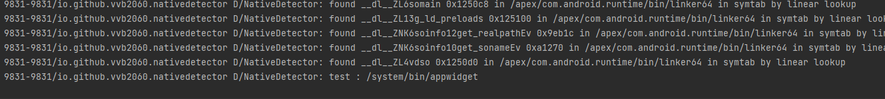

# zygisk
如果开启zygisk ,mount_zygisk
```cpp
    if (zygisk_enabled) {
        string zygisk_bin = MAGISKTMP + "/" ZYGISKBIN;
        mkdir(zygisk_bin.data(), 0);
        mount_zygisk(32)
        mount_zygisk(64)
    }
```
记录了对应位数的app_process的句柄，把magisk文件转移到zygisk/app_process里面去，同时将app_process的属性拷贝到app_process里面去
```cpp
#define mount_zygisk(bit)                                                               \
if (access("/system/bin/app_process" #bit, F_OK) == 0) {                                \
    app_process_##bit = xopen("/system/bin/app_process" #bit, O_RDONLY | O_CLOEXEC);    \
    string zbin = zygisk_bin + "/app_process" #bit;                                     \
    string mbin = MAGISKTMP + "/magisk" #bit;                                           \
    int src = xopen(mbin.data(), O_RDONLY | O_CLOEXEC);                                 \
    int out = xopen(zbin.data(), O_CREAT | O_WRONLY | O_CLOEXEC, 0);                    \
    xsendfile(out, src, nullptr, INT_MAX);                                              \
    close(out);                                                                         \
    close(src);                                                                         \
    clone_attr("/system/bin/app_process" #bit, zbin.data());                            \
    bind_mount(zbin.data(), "/system/bin/app_process" #bit);                            \
}

```

看app_process做了啥，只关注zygote的内容，首先执行zygisk_request(ZygiskRequest::SETUP);
```cpp
int app_process_main(int argc, char *argv[]) {
    android_logging();
    char buf[PATH_MAX];

    bool zygote = false;
    ····
    if (int socket = zygisk_request(ZygiskRequest::SETUP); socket >= 0) {
        do {
            if (read_int(socket) != 0)
                break;

            // Send over zygisk loader
            write_int(socket, sizeof(zygisk_ld));
            xwrite(socket, zygisk_ld, sizeof(zygisk_ld));

            int app_proc_fd = recv_fd(socket);
            if (app_proc_fd < 0)
                break;

            string tmp = read_string(socket);
            if (char *ld = getenv("LD_PRELOAD")) {
                string env = ld;
                env += ':';
                env += HIJACK_BIN;
                setenv("LD_PRELOAD", env.data(), 1);
            } else {
                setenv("LD_PRELOAD", HIJACK_BIN, 1);
            }
            setenv(MAGISKTMP_ENV, tmp.data(), 1);

            close(socket);

            fcntl(app_proc_fd, F_SETFD, FD_CLOEXEC);
            fexecve(app_proc_fd, argv, environ);
        } while (false);

        close(socket);
    }

    // If encountering any errors, unmount and execute the original app_process
    xreadlink("/proc/self/exe", buf, sizeof(buf));
    xumount2("/proc/self/exe", MNT_DETACH);
    execve(buf, argv, environ);
    return 1;
}
```
中间涉及socket传输，spoll啥的，最终追到这里来和他通信
```cpp
static void setup_files(int client, const sock_cred *cred) {
    LOGD("zygisk: setup files for pid=[%d]\n", cred->pid);

    char buf[4096];
    if (!get_exe(cred->pid, buf, sizeof(buf))) {
        write_int(client, 1);
        return;
    }

    bool is_64_bit = str_ends(buf, "64");

    if (!zygote_started) {
        // First zygote launch, record time
        clock_gettime(CLOCK_MONOTONIC, &last_zygote_start);
    }

    if (zygote_start_count) {
        // This zygote ABI had started before, kill existing zygiskd
        close(zygiskd_sockets[0]);
        close(zygiskd_sockets[1]);
        zygiskd_sockets[0] = -1;
        zygiskd_sockets[1] = -1;
    }
    ++zygote_start_count;

    if (zygote_start_count >= 5) {
        // Bootloop prevention
        timespec ts;
        clock_gettime(CLOCK_MONOTONIC, &ts);
        if (ts.tv_sec - last_zygote_start.tv_sec > 60) {
            // This is very likely manual soft reboot
            memcpy(&last_zygote_start, &ts, sizeof(ts));
            zygote_start_reset(1);
        } else {
            // If any zygote relaunched more than 5 times within a minute,
            // don't do any setups further to prevent bootloop.
            zygote_start_reset(999);
            write_int(client, 1);
            return;
        }
    }

    // Ack
    write_int(client, 0);

    // Hijack some binary in /system/bin to host loader
    const char *hbin;
    string mbin;
    int app_fd;
    if (is_64_bit) {
        hbin = HIJACK_BIN64;
        mbin = MAGISKTMP + "/" ZYGISKBIN "/loader64.so";
        app_fd = app_process_64;
    } else {
        hbin = HIJACK_BIN32;
        mbin = MAGISKTMP + "/" ZYGISKBIN "/loader32.so";
        app_fd = app_process_32;
    }

    // Receive and bind mount loader
    int ld_fd = xopen(mbin.data(), O_WRONLY | O_TRUNC | O_CREAT | O_CLOEXEC, 0755);
    string ld_data = read_string(client);
    xwrite(ld_fd, ld_data.data(), ld_data.size());
    close(ld_fd);
    setfilecon(mbin.data(), "u:object_r:" SEPOL_FILE_TYPE ":s0");
    xmount(mbin.data(), hbin, nullptr, MS_BIND, nullptr);

    send_fd(client, app_fd);
    write_st
```
```cpp
#define HIJACK_BIN64   "/system/bin/appwidget"
#define HIJACK_BIN32   "/system/bin/bu"

```
总结：
把zygisk loader传过去，mount到HIJACK_BIN上,LD_PRELOAD设置HIJACK_BIN来实现注入，fexecve执行原来的app_process

继续看app_loader
```cpp
static void zygisk_loader() {
    android_dlextinfo info = {
        .flags = ANDROID_DLEXT_FORCE_LOAD
    };
    // Android 5.x doesn't support ANDROID_DLEXT_FORCE_LOAD
    void *handle =
            android_dlopen_ext(SECOND_STAGE_PATH, RTLD_LAZY, &info) ?:
            dlopen(SECOND_STAGE_PATH, RTLD_LAZY);
    if (handle) {
        void(*entry)(void*) = dlsym(handle, "zygisk_inject_entry");
        if (entry) {
            entry(handle);
        }
    }
}

static void *unload_first_stage(void *) {
    // Wait 10us to make sure 1st stage is done
    timespec ts = { .tv_sec = 0, .tv_nsec = 10000L };
    nanosleep(&ts, nullptr);
    unmap_all(HIJACK_BIN);
    xumount2(HIJACK_BIN, MNT_DETACH);
    return nullptr;
}

extern "C" void zygisk_inject_entry(void *handle) {
    zygisk_logging();
    ZLOGD("load success\n");

    char *ld = getenv("LD_PRELOAD");
    if (char *c = strrchr(ld, ':')) {
        *c = '\0';
        setenv("LD_PRELOAD", ld, 1);  // Restore original LD_PRELOAD
    } else {
        unsetenv("LD_PRELOAD");
    }

    MAGISKTMP = getenv(MAGISKTMP_ENV);
    self_handle = handle;

    unsetenv(MAGISKTMP_ENV);
    sanitize_environ();
    hook_functions();
    new_daemon_thread(&unload_first_stage, nullptr);
}
```
清理环境变量 hook function

##检测
使用nativedetector来查看确实可以
